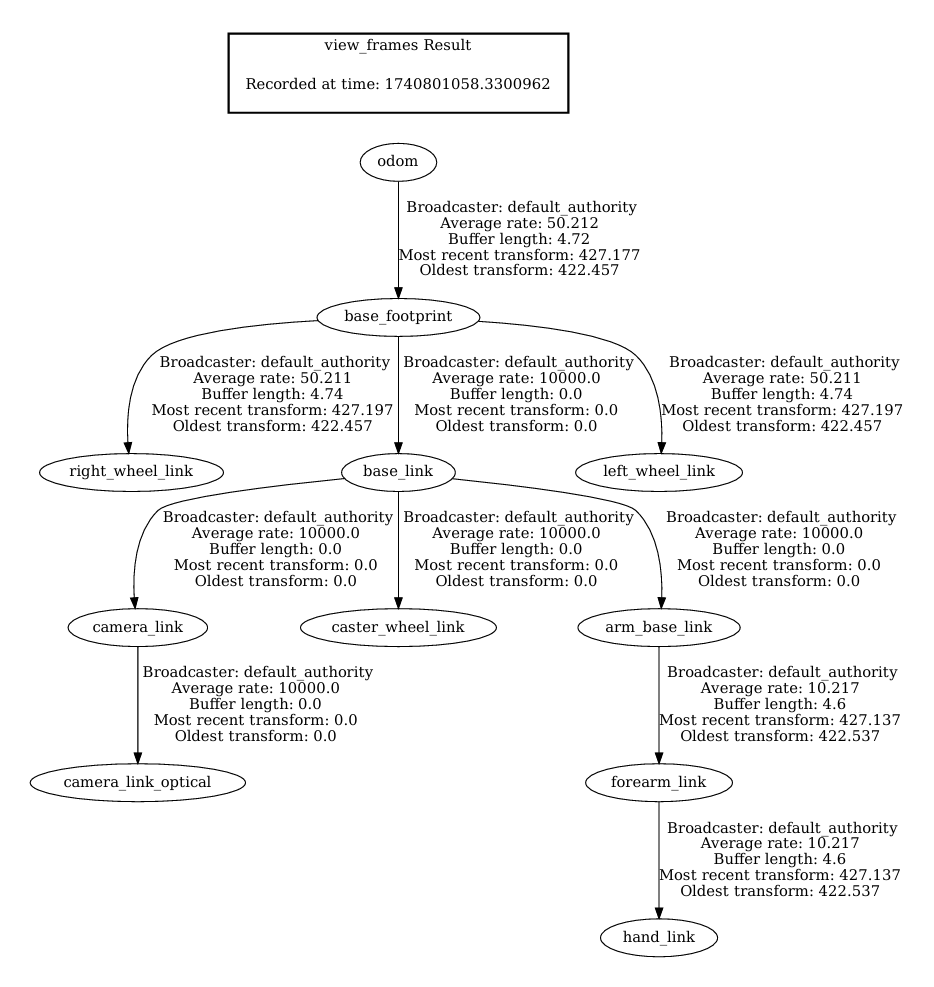

# Gazebo_Robot

## Overview

This repository contains a Gazebo simulation of a mobile robot designed to interact in a simulated environment. The project demonstrates the integration of robot modeling, simulation, and control using Gazebo and ROS (Robot Operating System).

## Demo


*Figure: Demonstration of the mobile robot interacting in the Gazebo simulation.*

## Repository Structure

- **src/**: Contains the source code for the robot's control and simulation.
- **build/**: Directory for build files generated during compilation.
- **install/**: Directory for installation files.
- **log/**: Contains log files from simulation runs.
- **complete_robot.gv**: Graphviz file representing the robot's transform (TF) tree.
- **complete_robot.pdf**: PDF version of the robot's TF tree.
- **mobile_robot.gif**: Animated demonstration of the robot in action.

## Documentation

### Transform (TF) Tree

The robot's TF tree illustrates the relationship between different coordinate frames of the robot. This is crucial for understanding the robot's kinematics and sensor data interpretation.



*Figure: Transform tree of the mobile robot.*

## Getting Started

To run the simulation:

1. **Clone the repository**:

   ```bash
   git clone https://github.com/ar1701/Gazebo_Robot.git
   ```

2. **Navigate to the repository**:

   ```bash
   cd Gazebo_Robot
   ```

3. **Build the project**:

   ```bash
   colcon build
   ```

4. **Source the setup file**:

   ```bash
   source install/setup.bash
   ```

5. **Launch the simulation**:

   ```bash
   ros2 launch my_robot_bringup my_robot_gazebo.launch.xml
   ```
   
## Dependencies

Ensure you have the following installed:

- ROS 2 (Humble)
- Gazebo
- colcon
- rviz2

## License

This project is licensed under the MIT License.

## Acknowledgments

Special thanks to the open-source community for providing tools and resources that made this project possible. 
